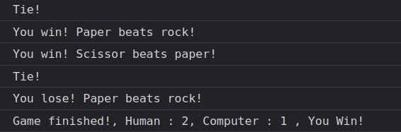

# odin-rock-paper-scissor
The Odin Project assignment to create rock paper scissor game using javascript programming language.

## Table of contents
* [Screenshot](#screenshot)
* [General info](#general-info)
* [Technologies](#technologies)
* [Link](#link)

## Screenshot

## General info
This is an exercise from The Odin Project to create simple rock paper scissor game using HTML and Javascript. Javascript was originally designed as a scripting language for websites but became widely adopted as a general-purpose programming language, and is currently the most popular programming language in use. *(Source: https://insights.stackoverflow.com/survey/2021#section-most-popular-technologies-programming-scripting-and-markup-languages)*

## Technologies
Project is created with:
* HTML
* Javascript

## Link
TBD
